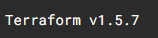

# Infrastructure as Code (IaC) with Terraform (Google Cloud)

## 📌 Overview
This lab demonstrates how to use **Terraform** to manage infrastructure on **Google Cloud Platform (GCP)**. You will learn how to configure Terraform, define resources, and perform lifecycle operations such as creation, modification, and deletion.

---

## 🎯 Objective
By completing this lab, you will:

- Verify Terraform installation
- Configure Google Cloud as a provider
- Create infrastructure using Terraform
- Modify existing infrastructure
- Destroy infrastructure resources

---

## 🧰 Prerequisites

- Google Cloud account
- Access to **Google Cloud Shell**
- Basic understanding of cloud infrastructure concepts
- Terraform installed (pre-installed in Cloud Shell)

---

## 🚀 Getting Started

### Step 1: Open Google Cloud Shell

1. Navigate to the Google Cloud Console
2. Click on **Activate Cloud Shell**
3. Wait for the terminal environment to initialize

---

### Step 2: Verify Terraform Installation

Run the following command:

```bash
terraform --version
```
The output will be:   

